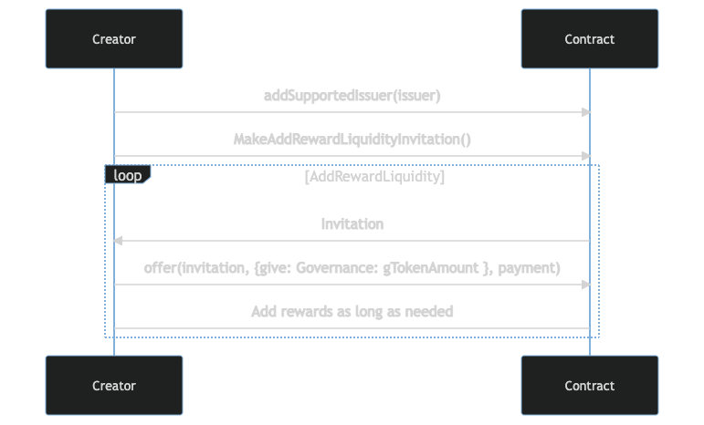
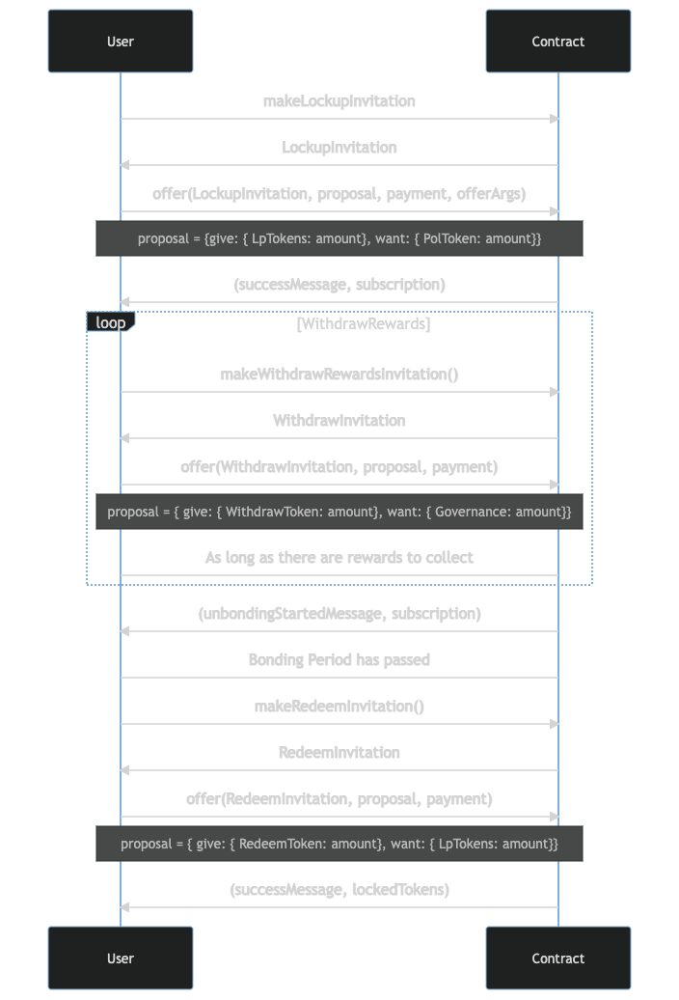
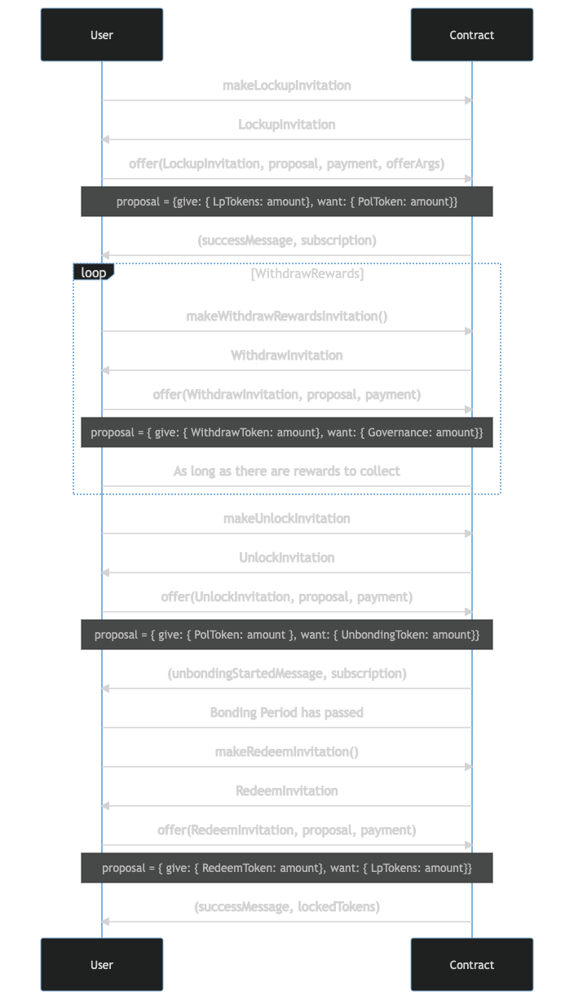

# IBC Liquidity Mining

## Bounty and Requirements
https://gitcoin.co/issue/27606

## How does it work?

### Strategies

On instantiation of the contract, the creator can choose what kind of liquity mining contract he wants to provide, mainly by making two choices:
 1. The `Lockup Strategy`, which indicates how the contract will handle token lockup by the users.
    - The `lock` strategy represents a timed lockup, i.e., a user always has to specify a bonding period (the amount of time, in days, the tokens will be locked).
    - The `unlock` strategy represents an indefinite lockup, i.e., the user will lockup their tokens and, in order to unlock them, another operation needs to be called. When this operation is called, an unbounding period starts (during which rewards will still be generated). This unbounding period can be provided by the user (in days) but it defaults to one day.
 2. The `Reward Strategy`, which indicates how the contract will calculate the rewards to be handed to the user:
    - The `linear` strategy, which quite simply applies the formula `amountOfLPTokensLocked * daysLockedIn * multiplier`. This multiplier can be defined by the creator when instantiating the contract, although it defaults to 1.
    - The `custom` strategy allows the creator to provide a function as the rewards calculator. The function signature should be `(amountOfLPTokensLocked, daysLockedIn) => { // Creator's reward calc logic here}`
    - The `tier` strategy allows the creator to provide an array of tiers to define how much rewards the user can collect. By definition, if the time passed is in the middle of two tiers, the user can only collect the rewards from the tier below. Each tier is an object which has two properties: 
        - `tokenAmount`, which is the amount of governance tokens to rewards in this tier
        - `timeAmount`, which is the number of days that have to have passed in order for the user to be rewarded with `tokenAmount` governance tokens.

### Operations

As any Agoric smart contract, it exposes two facets, the `creatorFacet` and the `publicFacet`. The first one can only be used by the creator and the second one can be used by anyone.
The `creatorFacet` essentially exposes three operations:
- `addSupportedIssuer`, which receives an issuer and adds it to the the issuers that are supported in this contract, i.e., the issuers of the LP tokens that we can lock in this contract
- `checkGovernanceTokenLiquidity`, which quite simply returns the current liquidity of governance tokens in the contract
- `MakeAddRewardLiquidityInvitation`, which creates an invitation so that the creator can add more liquidity for the governance tokens in the contract.

The `publicFacet` exposes six operations:
- `getPolTokenIssuer`, which returns the issuer of the POL (Proof Of Lockup) tokens (These tokens will be discussed in greater detail in the `Process` section)
- `isIssuerSupported`, which simply verifies if the contract supports a given issuer
- `makeLockupInvitation`, which creates an invitation so that the user can lockup their tokens
- `makeUnlockInvitation`, which creates an invitation so that the user can unlock their tokens and start the unbonding period. Please note that this operation only makes sense if the contract's lockup strategy is of type `unlock`, otherwise an error will be thrown
- `makeRedeemInvitation`, which creates an invitation so that the user can redeem their LP Tokens. In order for this operation to work, the bonding period (in case of the `lock` strategy) or the unbonding period (in case of the `unlock` strategy) should have passed and all rewards should have been collected. An error is thrown if these two conditions are not met
- `makeWithdrawRewardsInvitation`, which creates an invitation for the user to withdraw the rewards that he has collected until that moment in an `at least` basis, i.e., the user specifies how many he should **at least** receive and the contract checks that, of course. Do note that the user is constantly warned how many rewards he can collect through the subscription.

### Process

The first process to talk about is the creator one, after instantiation of the contract. As seen in the image below, essentially the creator should add supported issuers and governance token liquidity as required. 

Apart from this, the process of interacting with this smart contract by the users can be two-fold, one for the `lock` strategy and another for the `unlock` strategy.

Although both processes are very similar (there is only one additional step in the unlock process), there are some things to clear up, namely all the tokens that appear in the proposals.
As will be seen in the diagrams, four types of tokens appear in them, `PolToken`, `UnbondingToken`, `WithdrawToken`, `RedeemToken`. These are all NFTs. This is just for naming convention and to make it clear in the proposal what is expected and what it is the user will be doing. In reality, all those tokens come from the same issuer, the only difference between them is the metadata they hold which is necessary for the next step. 
Another thing to note, although the `WithdrawToken` is given in the proposal to withdraw, it is never actually taken from the user since it will be needed for further withdrawals and, ultimately, for redeeming.

#### "Lock" Lockup

#### "Unlock" Lockup

The introduction of these NFTs was a consequence of the necessity to keep track of the lockup data from a user, such as the amount locked in , how many governance tokens as the user collected from the rewards, the timestamp of when the user locked the tokens, etc. And, with these NFTs, in addition to actually providing the user a proof that he has locked his tokens, we are also able to easily identify the unique lockup. 
        

